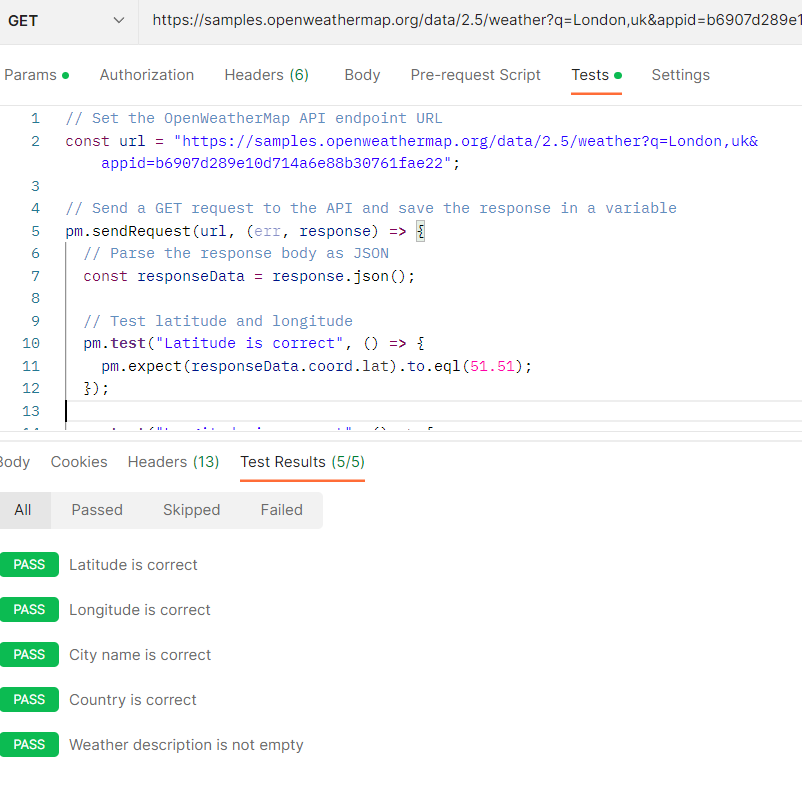

# Testing OpenWeatherMap API

This GitHub repository is part of a "Coderbyte" online assessment and includes both Postman and Python implementations for testing the OpenWeatherMap API. It contains sample requests with test cases.

